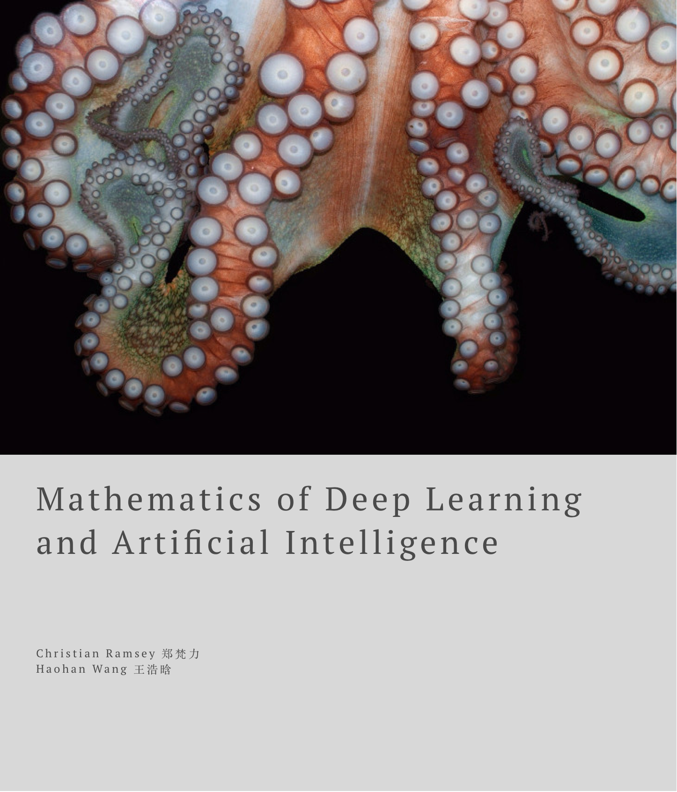

--- 
title: "Mathematics for Deep Learning and Artificial Intelligence"
author: "Christian Ramsey & Haohan Wang"
knit: "bookdown::render_book"
date: "`r Sys.Date()`"
output: pdf_document
description: learn the foundational mathematics required to learn and apply cutting edge deep learning techniques. From Aristolean logic to Jaynes theory of probability to Rosenblatt's Perceptron and Vapnik\'s Statistical Learning Theory
documentclass: book
link-citations: yes
bibliography:
- book.bib
- packages.bib
site: bookdown::bookdown_site
colorlinks: yes
biblio-style: apalike
url: 'https\://m4dl.com'
github-repo: dyadxmachina/maths-for-deep-learning-ai
cover-image: artwork/m4dl.png
---
# Preface {-}


## Chapter Updates

Join over **800+** others to get chapter by chapter updates sent to your email.

**Get chapter updates sent to your email.**
```{r echo=FALSE, results="asis"}

library(readr)
cat( paste( readLines( "mailchimp.html" , warn = FALSE) ) )

```


## About the Authors
Independent deep learning researchers focused on using machine learning for the good of humanity. Focused on applying deep learning applications in [mental health](http://dyadxmachina.com) (i.e. neuroscience) and [education](https://github.com/dyadxmachina/can-machines-teach).


[Haohan Wang - LinkedIn](https://www.linkedin.com/in/haohanw)

[Fanli Zheng (Christian) - LinkedIn](https://www.linkedin.com/in/christianramsey/)

## Contact
Feel free to contact us if you have any questions:
Visit our website [dyad x machina](dyadxmachina.com) or email us @ two@dyadxmachina.com

Haohan Wang: haohan723@gmail.com

Fanli Zheng (Christian): thechristianramsey@gmail.com